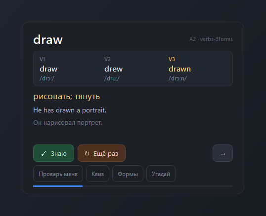
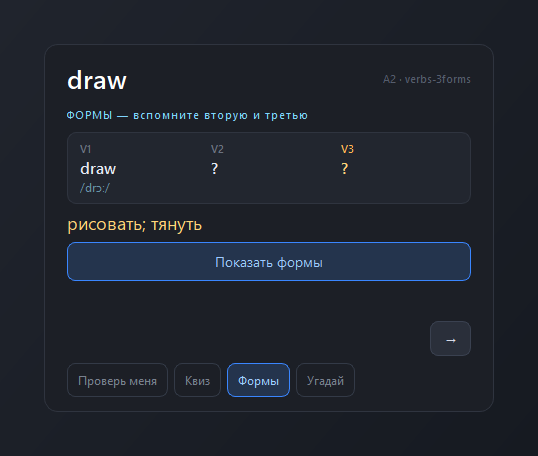
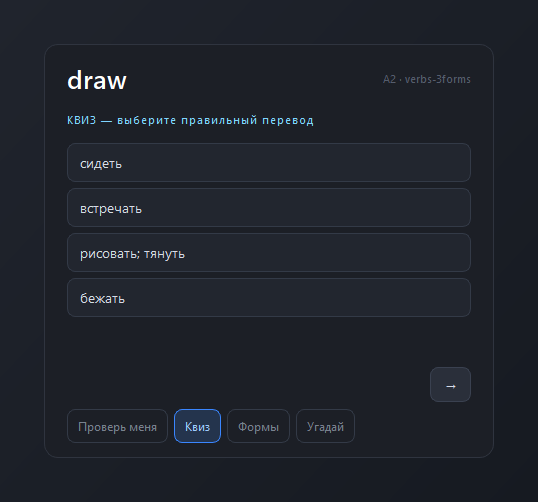
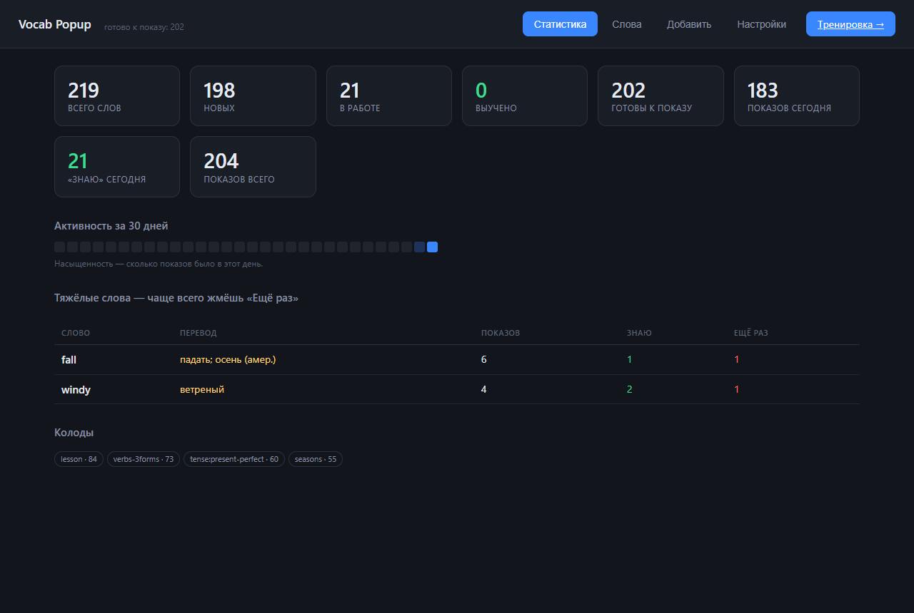
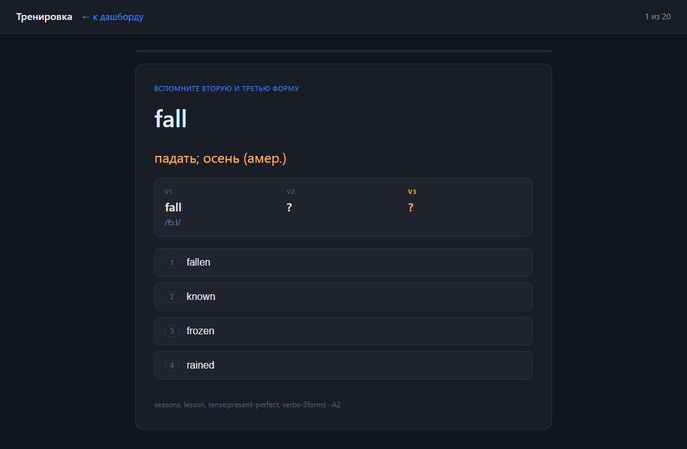
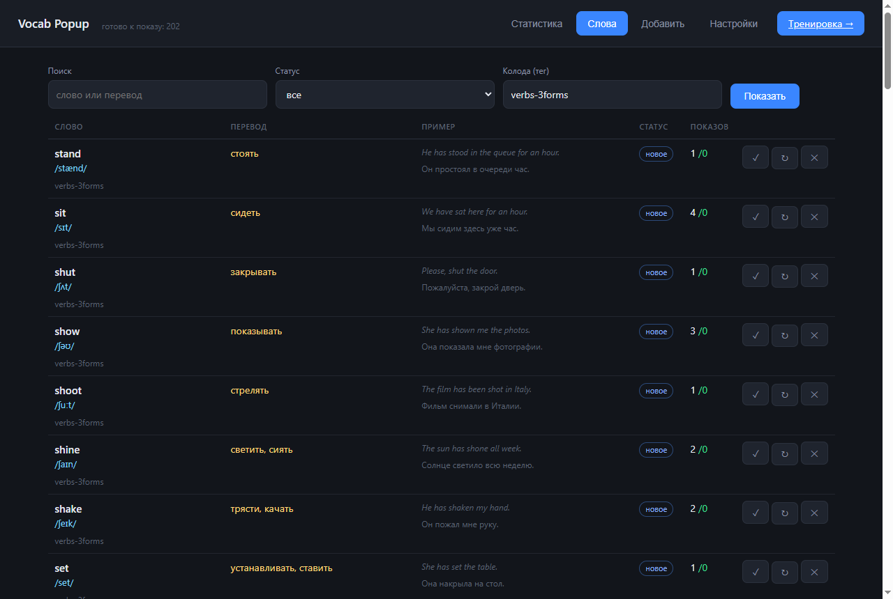

# Vocab Popup

Английские слова приходят к вам сами, пока вы работаете за компьютером.

Раз в несколько минут в углу экрана появляется карточка: слово, транскрипция,
перевод и пример предложения. Живёт в трее, помнит, что вы уже знаете,
и планирует повторы по алгоритму интервальных повторений — как в Anki, только
идти к карточкам не нужно, они приходят сами.



Приложение не забирает фокус: набор текста не прерывается, карточка просто
висит поверх окон. Ответить можно горячими клавишами, не целясь мышью.

---

## Что умеет

**Показывает, не мешая.** Карточка появляется раз в N минут, гаснет сама через
14 секунд. Не появляется в тихие часы, на паузе и поверх полноэкранного
приложения — игры, презентации, звонка.

**Планирует повторы.** Знакомое слово уходит всё дальше: 10 минут → час →
5 часов → сутки → неделя. Забытое возвращается через 10 минут.

**Проверяет, а не только показывает.** Четыре режима запускаются прямо
с карточки — они не заменяют показ, а включаются по желанию.

| Режим | Что делает |
|---|---|
| Проверь меня | Прячет перевод, пока не нажмёте «Показать» |
| Квиз | Четыре варианта перевода, неверные — из той же колоды |
| Формы | Для глаголов: V2 и V3 скрыты, надо вспомнить |
| Угадай | Слово скрыто, показан перевод — напишите по-английски |



**Знает три формы глагола.** Отдельная колода: V1, V2, V3 с транскрипцией
каждой формы. Это важнее, чем кажется — `read` во всех трёх формах пишется
одинаково, но вторая и третья читаются `/red/`, как *red*. Так же ведут себя
`say → /sed/`, `mean → /ment/`, `hear → /hɜːd/`.



**Ведёт статистику.** Каждый показ записывается и никогда не удаляется:
сколько раз показали слово, сколько раз вы его вспомнили, на каких словах
спотыкаетесь чаще всего.



**Даёт тренироваться пачкой.** Когда есть свободные десять минут — режим
сессии на 10–50 карточек подряд, с управлением с клавиатуры.



---

## Установка

Нужен [Python 3.10+](https://www.python.org/downloads/) для Windows.
При установке отметьте галочку **Add Python to PATH**.

```
git clone <адрес-репозитория>
cd vocab-popup
install.bat
```

`install.bat` поставит зависимости (PySide6, Flask) и загрузит стартовый
словарь — 219 слов в четырёх колодах. Дальше:

| Файл | Что делает |
|---|---|
| `start.bat` | Запуск — иконка появляется в трее |
| `start-debug.bat` | То же, но с консолью: видно ошибки |
| `autostart.bat` | Включает/выключает автозапуск при входе в Windows |

Дашборд открывается двойным кликом по иконке в трее или по адресу
<http://127.0.0.1:8777/>.

---

## Управление

**Иконка в трее:** левый клик — показать слово сейчас, правый — меню
(пауза, интервал, положение на экране, дашборд).

**Горячие клавиши** работают из любого окна:

| Сочетание | Действие |
|---|---|
| `Ctrl+Alt+1` | знаю — интервал растёт |
| `Ctrl+Alt+2` | ещё раз — вернуть через 10 минут |
| `Ctrl+Alt+3` | пропустить |
| `Ctrl+Alt+0` | показать слово прямо сейчас |

Обычные `Enter` / `2` / `Esc` тоже работают, но только после клика по карточке.
Так задумано: карточка намеренно не забирает фокус, иначе она обрывала бы
набор текста — а раз фокуса нет, до неё не доходят и обычные нажатия.

Наведение мышью останавливает таймер, пока читаете.

---

## Свои слова

Вкладка **«Добавить»** — по одному в строке:

```
achieve | достигать, добиваться | /əˈtʃiːv/ | She has achieved a lot. | Она многого достигла.
spring | весна | /sprɪŋ/
autumn | осень
```

Разделитель — `|`, таб или `;;`. Заполнять всё необязательно: хватит
`слово | перевод`. Транскрипция узнаётся по слешам в любой позиции.
Строки с `#` пропускаются. Поле «Колода» проставляет тег всей пачке.

Повторный импорт существующего слова не создаёт дубль — он дополняет пустые
поля, не затирая заполненные.

Файлы в `seeds/` — тот же формат, их можно править руками и перезагружать
командой `python seed.py` (повторять безопасно).



---

## Как выбирается следующее слово

1. Из выборки выкидываются 25 последних показанных — слово не повторится,
   пока не пройдут другие.
2. Программа решает, взять повтор или новое слово. Доля повторов зависит от
   того, сколько их созрело: при пяти созревших — 8% показов, при двадцати
   четырёх — 40%, выше не поднимается.
3. Если задана **фокус-колода**, 80% показов идут из неё — так текущая тема
   не тонет в общем словаре.
4. Новые слова берутся в случайном порядке.

После показа слово получает новый срок:

| Ответ | Когда вернётся |
|---|---|
| Знаю (первый раз) | 10 минут |
| Знаю (второй) | 1 час |
| Знаю (третий) | 5 часов |
| Знаю (дальше) | ×2.5 каждый раз, до полугода |
| Ещё раз | 10 минут |
| Ничего не нажали | 90 минут |

К каждому сроку добавляется разброс ±10%, чтобы слова не приходили пачкой.

Дневного лимита новых слов по умолчанию нет — перебирается весь словарь.
Включить порцию можно в настройках (поле дневного лимита).

---

## Настройки

Интервал показа, время жизни карточки, задержка перед показом перевода
(сначала пробуете вспомнить сами), положение на экране и отступ, размер
карточки, фокус-колода, тихие часы. Интервал и положение подхватываются
на лету — перезапуск не нужен.

**Размер карточки** по умолчанию подстраивается под экран: на ноутбуке
1366×768 она компактнее, на 4K — заметно крупнее. Пересчитывается при каждом
показе, поэтому на втором мониторе с другим разрешением размер верный.

---

## Стартовые колоды

| Колода | Слов | О чём |
|---|---|---|
| `verbs-3forms` | 73 | Неправильные глаголы: три формы с транскрипцией каждой |
| `lesson` | 84 | Разговорная лексика: быт, поездки, деньги, характер |
| `tense:present-perfect` | 60 | Маркеры времени и глаголы в третьей форме |
| `seasons` | 55 | Времена года, погода, природа |

Слово может лежать в нескольких колодах — теги объединяются.

---

## Устройство

```
main.py         трей, планировщик показов, тихие часы, горячие клавиши
popup.py        карточка: показ и режимы проверки, поверх окон, без фокуса
srs.py          интервальные повторения и выбор следующего слова
quiz.py         варианты для квиза, сверка введённого ответа
verbforms.py    разбор трёх форм глагола
hotkeys.py      глобальные сочетания клавиш Windows
db.py           SQLite: words / srs / events / settings
webapp.py       Flask: дашборд и тренировка на 127.0.0.1:8777
templates/      index.html — дашборд, train.html — тренировка
seeds/          стартовые колоды в формате импорта
data/vocab.db   ваша база (в репозиторий не попадает)
data/app.log    журнал работы
```

Вся база — один файл `data/vocab.db`. Резервная копия — просто скопировать его.

---

## Если что-то пошло не так

**Карточки не появляются.** Проверьте `data/app.log` — там пишется причина:
`Показы приостановлены: тихие часы` / `пауза` / `полноэкранное приложение`.
Тихие часы по умолчанию с 23:00 до 08:00, их можно сдвинуть или выключить
в настройках.

**Иконка пропала из трея.** В `data/app.log` будет ошибка со стеком.

**Второй запуск** не создаёт второй экземпляр: показывает сообщение и выходит.

**Сочетание клавиш занято** другой программой — в лог попадёт предупреждение,
остальные продолжат работать.

---

## Что дальше

Автозаполнение карточек через OpenRouter: модуль берёт слова без перевода
и дозаполняет перевод, транскрипцию, пример и формы. Поля для ключа и модели
уже есть в настройках, сам конвейер пока не подключён.

---

## Лицензия

MIT — см. [LICENSE](LICENSE).
